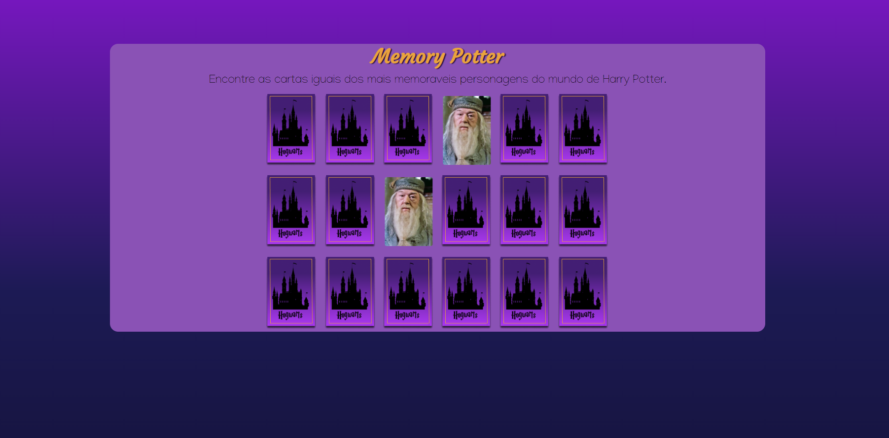

# Jogo da Mémoria - Harry Potter

## EM CONSTRUÇÃO 🏗️

## Objetivos:

Criar um jogo de mémoria em que a jogabilidade seja feita pela linguagem de JavaScript.

## Linguagens usadas:

* Html
* Css
* JavaScript

### Data do Projeto:

Inicio: 29/05/2022 
Fim: 04/05/2022

Entrega alterada para dia : 03/05/2022

### Execução

https://precious-jelly-1e28de.netlify.app/

#### To-do List:

- [x] Trocar cartas por grid.
- [x] Flip das cartas.
- [x] Jogabilidade: Cartas escolhidas viram, se forem iguais se  permanecem com personagem para frente.
- [x] Cartas precisam se embaralhar ao iniciar

#### Oportunidades de melhoria: 

- [] Botão de resetar, reembaralhando todas as cartas
- [] Responsividade das imagens: Diminuir cartas ao diminuir tela.
- [] Colocar icone na aba do navegador.
- [] Cursor do mouse como varinha.
- [] Fundo Animado com estrelas.

### Preview

